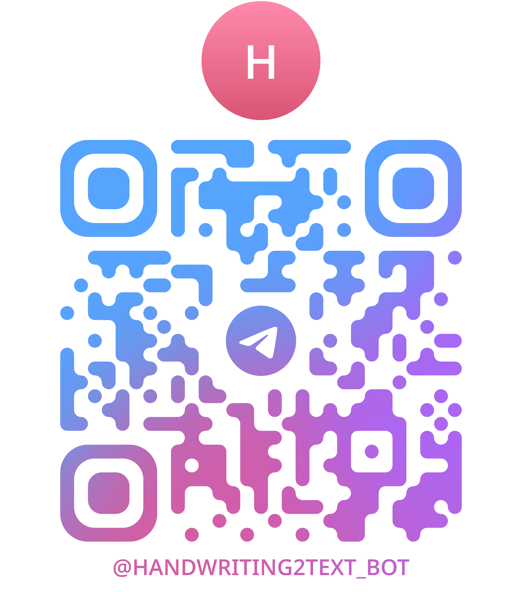
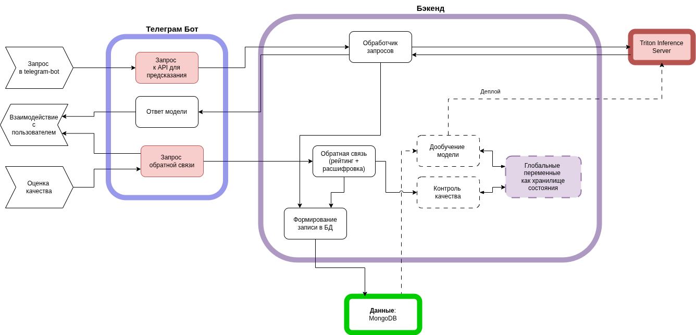

# HandWritingDescriptor

Система распознавания рукописного текста, состоящая из следующих компонентов:

- Backend API для обработки запросов
  - REST API на Python для обработки изображений и текста
  - Интеграция с базой данных MongoDB для хранения результатов распознавания
  - Асинхронная обработка запросов для эффективной работы с изображениями
  - Система логирования и мониторинга

- Telegram бот для удобного взаимодействия
  - Простой интерфейс для загрузки изображений
  - Интерактивные клавиатуры для управления процессом распознавания
  - Возможность получения результатов в текстовом формате
  - Обработка различных типов сообщений и команд

- Triton Model Repository для хранения и обслуживания моделей машинного обучения
  - Оптимизированное обслуживание моделей для быстрого инференса
  - Поддержка различных форматов моделей (ONNX, TensorRT)
  - Масштабируемость и балансировка нагрузки
  - Версионирование моделей для обеспечения стабильности работы

- MongoDB для хранения данных
  - Сохранение истории распознаваний
  - Хранение метаданных изображений
  - Быстрый доступ к результатам

Проект позволяет распознавать рукописный текст с помощью современных методов компьютерного зрения и машинного обучения. Использование Triton Inference Server обеспечивает высокую производительность и масштабируемость системы, позволяя обрабатывать множество запросов одновременно с минимальными задержками.

# Итоговая архитектура

Изменения:
- В качестве базы данных выбрана Mongo
- Препроцессинг перенесен на бэкенд, телеграм работает как прослойка для пользователя
- Модуль дообучения и логгирования еще в разработке
