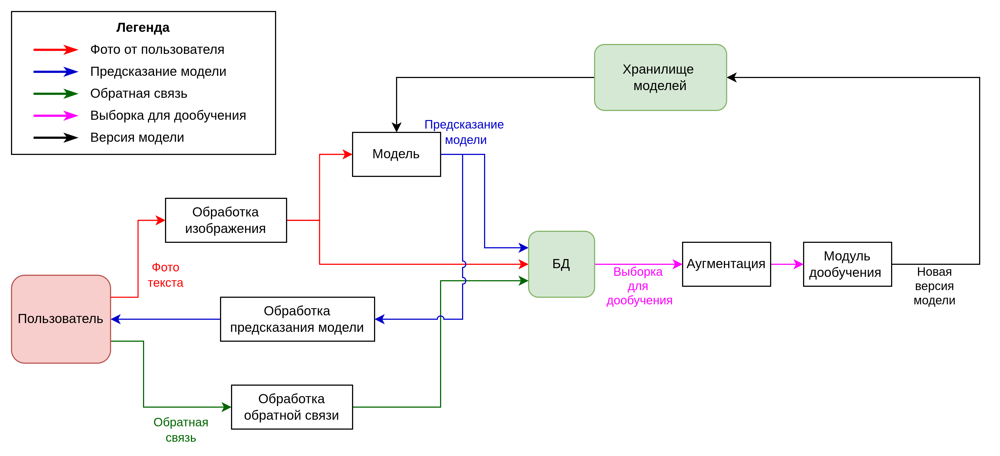

# Выбор подхода 
Для решения задачи выбран подход `ETL` (Extract, Transform, Load). Извлечение данных происходит в рамках фронтенда, на нем же будет реализованы необходимые преобразования данных. Все, что попадает в базу данных, будет уже преобразовано.

Для хранения данных будет использоваться связка `MinIO` + `Mongo`. В `Mongo` будет храниться информация о запросах: идентификаторы пользователя, запроса и изображения, результат работы модели, оценка пользователя, расшифровка обратной связи (если она имеется). `Mongo` поддерживает вложенность структур и массивы, что необходимо, так как одно из полей - список. 

**Пример схемы:**

```json
{
  "user_id": "usr_12345",
  "request_id": "req_98765",
  "image_id": "img_7654",
  "created_at": "2023-10-15T12:34:56Z",
  "processing_time": 2.5,
  "detections": [
    {
      "bbox": [10, 20, 100, 200],
      "text": "Hello World!",
      "score": 0.95
    },
    {
      "bbox": [150, 300, 250, 400],
      "text": "Goodbye!",
      "score": 0.85
    }
  ],
  "user_rating": 9,
  "user_transcription": "" 
}
```

`MinIO` - объектное хранилище, необходимо для хранения изображений. Основные преимущества - масштабируемость, производительность, отказоустойчивость. Оно же может использоваться для хранения весов моделей (данные будут лежать в одном кластере, но в разных бакетах).

# Data Pipeline
## Data Flow Diagram
1. **Внешняя сущность** - пользователь. Он отправляет первичные данные - фото текста и обратную связь, а принимает предсказание модели.
2. **Процессы** - отвечают за всевозможные преобразования данных: обработка данных от или для пользователя, работа модели, аугментация, дообучение. Могут как изменять входные данные, так и генерировать новые. Отмечены в виде обычных прямоугольников с названием процесса.
3. **Хранилища данных** - хранят всю необходимую информацию. Для системы есть два хранилища - хранилище моделей, к которому может подключаться сервер для инференса, а также сама база данных (фото, расшифровки, идентификаторы и отзывы пользователей).
4. **Потоки данных** описаны на диаграмме стрелками. Цвет стрелки означает тип потока, описаны в легенде.



## Аугментация
Для дообучения необходима аугментация данных. Она может выполняться "на лету", при загрузке оригинальных данных из датасета в даталоадер. У этого метода ряд преимуществ:
- нет дополнительной нагрузки на БД для сохранения новых данных
- большая вариативность в данных: можно установить вероятности применения для каждой из аугментаций, а также различные стратегии выбора преобразования
- даже если изображение уже попадало в дообучающую выборку, наличие аугментаций на лету снизит вероятность того, что в модель оно попадет несколько раз в одинаковом виде

Реализация - через библиотеку `Albumentations` или аналоги:
```python
import cv2
import albumentations as A

transform = A.Compose([
    A.RandomBrightnessContrast(p=0.5),
    
    A.HorizontalFlip(p=0.25),
    A.VerticalFlip(p=0.25),
    
    A.RandomCropFromBorders(crop_value_low=0.05, crop_value_high=0.15, p=0.1),
    
    A.OneOf([
        A.GaussianBlur(blur_limit=(3, 7)), 
        A.GaussNoise(var_limit=(10., 50.))
    ], p=0.2),
    
    A.MotionBlur(blur_limit=7, always_apply=False, p=0.1),
])

image = cv2.imread('handwritten_text_crop.jpg')
image_rgb = cv2.cvtColor(image, cv2.COLOR_BGR2RGB)
augmented_image = transform(image=image_rgb)['image']
```