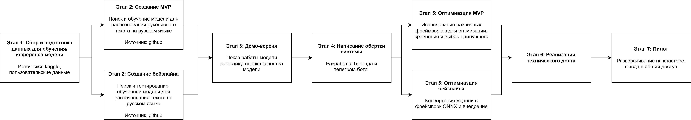
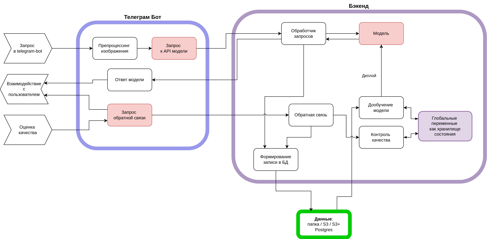

# Дизайн ML системы - Телеграм-бот для распознавания рукописного почерка

## 1. Цели и предпосылки 
### 1.1. Зачем идем в разработку продукта?  

- С ростом числа электронных устройств люди все меньше и меньше пишут от руки, а значит, почерк ухудшается. При этом в некоторых сферах есть необходимость в написании чего-либо от руки
- Сервис поможет упростить разные рутинные задачи: проверка заданий у школьников, распознавание медицинских рецептов и другие
- Сервис может быть внедрен в разные системы по требованию сторонних заказчиков

### 1.2. Бизнес-требования и ограничения  
**Бизнес-требования**
- Высокое качество распознавания текста
- Поддержка разных языков (в приоритете - русский и английский)

**Бизнес-ограничения**
- Сервис должен быть быстрым: время отклика менее 1 секунды
- Сервис не должен требовать значительных серверных мощностей

### 1.3. Описание первой итерации объекта

- На первой итерации проекта закрываются требования по качеству распознавания для модели на русском языке. Поддержка нескольких языков в первую итерацию не входит.
- На начальной итерации также не будет достигнуто требование по серверным мощностям: ожидается, что пока требованию по времени удовлетворяет только работа на GPU. Оптимизация - базовая, например конвертация в фреймворк ONNX.

**Требования к коду**
- Код удовлетворяет требованиям PEP (для проверки используется Ruff)
- Воспроизводимость решения: разворачивание системы происходит в докер-контейнере, за счет этого окружение полностью воспроизводимо

**Технический долг**
- Исследование оптимизации моделей
- Интеграция логики дообучения модели
- Разделение окружений/контейнеров для инференса и обучения модели
- Минимизация количества используемых фреймворков в инференсе (в идеале инференс воспроизводить через ONNX, в отдельном окружении)

## 2. Методология

### 2.1. Постановка задачи  

**ML-задача**: OCR - Optical Character Recogniiton, Визуальное распознавание символов. 

**Другие технические задачи**: 
- оптимизация моделей с помощью различных фреймворков для достижения бизнес-требования по времени обработки запроса
- написание бэкенда в виде сервиса, принимающего запросы к модели
- написание телеграм-бота для пользователей

### 2.2. Блок-схема решения  

### 2.3. Этапы решения задачи 

1. **Описание и обработка данных** 
    
    Цветокоррекция, нормализация, необходимый паддинг - одинаково как для бейзлайна, так и для MVP

2. **Создание моделей** 
    
    * Бейзлайн: используется предобученная модель из фреймворка EasyOCR. 
    * MVP: модель из этого же фреймворка, обученная на рукописных данных.
    * Оптимизируемые метрики: CER (Character Error Rate), WER (Word Error Rate), их целевые значения > 90%
    * Ожидается получить модели со следующим форматом ввода/вывода: ввод - фото, вывод - csv-файл с колонками: слово, уверенность модели, координаты на кадре.
    * *Риски*: недостаточное качество моделей

3. **Демо-версия** 
    
    Оценка качества модели по метрикам WER, CER. Показ работы заказчику.

4. **Написание обертки системы**
    * Реализована очередь доступа к модели: поступаемые запросы попадают в очередь, из которое модель берет кадры (по одному или батчами заданного размера), обрабатывает, возвращает результат нужному пользователю.
    * Написан телеграм-бот на aiogram, реализующий следующие функции: загрузка фотографии рукописного текста, вывод результата в двух вариантах: текстовая расшифровка и разметка на фото.
    * Результат: работающий телеграм-бот, реализующий основной функционал. Доступен для первичного тестирования заказчиком.

5. **Оптимизация**
    * И для бейзлайна, и для MVP речь идет про оптимизацию *инференса*
    * Бейзлайн: модель конвертирована в ONNX. Ускорение на CPU конфигурируется через установление числа потоков.
    * MVP: рассматриваются разные методы и фреймворки для оптимизации модели: ONNX, TensorRT, прунинг или квантование модели. Сравнивается время работы модели, падение качества конвертированной модели, стабильность алгоритма конвертации. По этим критериям выбирается метод, который будет использоваться в проде
    * *Риски*: недостаточная скорость работы для достижения бизнес-метрик

6. **Реализация технического долга**

    Происходит итоговая доработка системы: 
    * написание триггера дообучения модели
    * добавление аугментаций при загрузке дополнительного фрагмента датасета
    * получение обратной связи от пользователя
    
    Также на данном этапе проводится тестирование системы.

7. **Пилот**
    * Разворачивание сервиса на проде
    * Настройка кластера
    * Нагрузочное тестирование

## 3. Подготовка пилота  
  
**Способ оценки пилота**: 
* проверка качества модели целевой группой (пользователи отмечают качество работы модели в телеграм-боте)
* расчет бизнеc-метрик: активность пользователей (DAU/WAU/MAU, Retention Rate), конверсия, оценка удовлетворенности пользователей (по их обратной связи), технические характеристики (также по обратной связи). Финансовую эффективность не оценить, так как продукт на данном этапе бесплатный.

**Успешный пилот**: фидбек пользователей положителен, есть прирост числа новых пользователей.

**Вычислительные мощности**: требуется виртуальная машина/контейнер, развернутые на сервере. В качестве сервера могут использоваться облачные провайдеры.

## 4. Внедрение 
  
### Архитектура решения   
  
**Общая схема решения**

Проект состоит из двух крупных модулей: телеграм-бот и бэкенд. Телеграм-бот отвечает за работу с пользователем: получение от него данных, отправку запроса на API бэкенда, формирование запроса для получения обратной связи, отправку полной информации о запросе в БД.

Бэкенд принимает запросы, организует очередь обращения к модели. Также он отвечает за анализ качества работы модели и организацию дообучения. 

**Точки интеграции**

К настроенному бэкенду можно подключать любой фронтенд, реализующий методы API - как телеграм-бот, так и веб-приложение.

### Инфраструктура системы

* **Описание инфраструктуры и масштабируемости**
    - В качестве инфраструктуры выбран кластер Kubernetes, развернутый в облаке. 
    - Сервер Intel Cascade Lake c 32Гб ОЗУ и загрузочным диском 20Гб будет стоить 9630 руб/месяц. Кластер MongoDB для хранения данных, объемом 200 Гб, стоит около 11000 руб/месяц.
    - При начале работы можно значительно сэкономить, уменьшив объем выделенного кластера Mongo/
    - При расширении можно увеличить число и мощность виртуальных машин, настроить кластер Kubernetes и балансировщики нагрузки.

* **Требования к работе системы:** доступность 99.999% времени, задержка ответа - до 1 секунды.

* **Безопасность системы и данных:** основная уязвимость заключается в доступе к информации, отправленной в чат. В рамках телеграм-бота защита данных обеспечивается самим Telegram, со стороны бэкенда - через ограничение доступа к модели и к базе данных.
  
* **Риски:** основные риски заключаются в доступности облачной инфраструктуры. По заявлению Яндекса, Compute Cloud имеет доступность 99.95%.