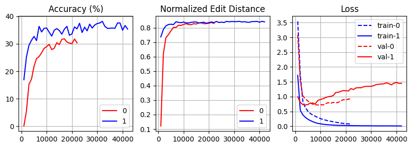

## Модели для распознавания текста
В качестве первого эксперимента были обучены две модели:

0. Датасет с русским рукописным шрифтом, обучение с 0
1. Датасет с русским рукописным шрифтом, обучение с предварительно обученного для русского языка чекпойнта

### Результаты

| Model_version |   WER  |   CER  |
|---------------|--------|--------|
| 0             |  81.9% |  28.9% |
| 1             |  84.3% |  30.7% |

### Логи

### Логика дообучения
1. При появлении в БД фиксированного количества сэмплов запускается процесс дообучения
2. Если метрики полученной модели лучше, чем метрики последней версии и результаты работы на доп. выборке лучше, чем у предыдущей версии, то полученная модель фиксируется как новая версия
3. Новая версия модели загружается в нужную директорию, откуда её автоматически подгружает сервер инференса модели (будет использоваться Nvidia Triton Inference Server)
